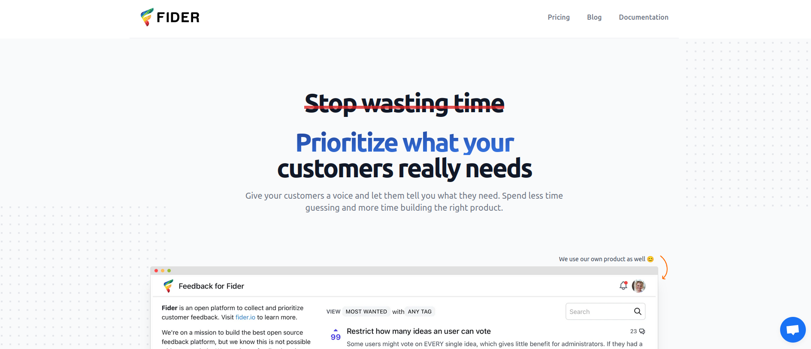

# Fider

It was a good way to start learning docker and more complex setup , so I was wondering why not playing around with this project called [Fider](https://fider.io/)

## Docker is love 🐳
No waste of time , use the `docker-compose.yaml` file to make the **fider** application up and running in no time.
 Some container will be deployed along side of fider one.
 - `redis` database used for caching
 - `postgres` database to store data
 - `fider`: core application
 ### Configuration
 #### Postgres
 For local testing you can keep default values
 |Variable                          |Value                         |
|-------------------------------|-----------------------------|
|`POSTGRES_USER`            |postgres            |
|`POSTGRES_PASSWORD`            |postgres    |
|`POSTGRES_DB`|postgres|

 #### Fider
  |Variable                          |Value                         |
|-------------------------------|-----------------------------|
|`DATABASE_URL`            |postgres database url            |
|`JWT_SECRET`            |token to authenticate request, see [token](https://www.allkeysgenerator.com/Random/Security-Encryption-Key-Generator.aspx)   |
|`EMAIL_NOREPLY`|noreply@yourdomain.com|
|`EMAIL_SMTP_HOST`|smtp.gmail.com|
|`EMAIL_SMTP_PORT`|587|
|`EMAIL_SMTP_PORT`|noreply@yourdomain.com|
|`EMAIL_SMTP_USERNAME`|xxxx@gamil.com|
|`EMAIL_SMTP_PASSWORD`|email password|
|`OAUTH_GITHUB_CLIENTID`|xxxxx|
|`OAUTH_GITHUB_SECRET`|xxxxx|

## K8s is God ☸️
No waste of time also  , use the kubernetes resources files deploy the application on kubernetes nodes.
Refer to docker config section to setup the proper variables.
- `kubectl apply -f k8s/`